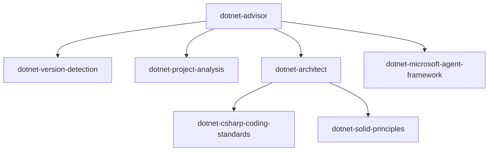

---
description:
  'Generate dependency graphs for skills. Visualize skill relationships, cross-references, and usage patterns as Mermaid
  diagrams.'
targets: ['*']
---

# /dotnet-harness:graph

Visualize skill dependencies and relationships.

## Usage

```bash
/dotnet-harness:graph [options]
```

## Parameters

- `--skill`: Generate graph for specific skill
- `--category`: Graph all skills in category
- `--depth`: Maximum dependency depth (default: 3)
- `--format`: Output format (`mermaid`, `svg`, `png`, `dot`)
- `--output`: Output file path

## Examples

```bash
# Full skill dependency graph
/dotnet-harness:graph --format mermaid --output skills-graph.md

# Graph for specific skill
/dotnet-harness:graph --skill dotnet-advisor --depth 2

# Category-specific graph
/dotnet-harness:graph --category ui --format svg --output ui-skills.svg

# Generate DOT format for Graphviz
/dotnet-harness:graph --format dot --output dependencies.dot
```

## Output Formats

### Mermaid (Default)



### SVG/PNG

Renders visual dependency diagram.

### DOT

Graphviz-compatible format for custom visualization.

## Graph Types

**Dependency Graph** (default):

- Shows `[skill:x]` references
- Displays dependency chains
- Highlights circular dependencies

**Category Graph**:

- Skills grouped by category
- Cross-category connections
- Tag-based clustering

**Usage Graph** (requires session data):

- Most frequently used skills
- Skill combinations
- Execution flow patterns

## Analysis Features

- **Circular Dependency Detection**: Warns about circular `[skill:x]` references
- **Orphan Skills**: Lists skills with no references
- **Hub Skills**: Identifies heavily-referenced skills
- **Category Boundaries**: Shows cross-category dependencies

## Command Examples

### Detect Circular Dependencies

```bash
/dotnet-harness:graph --check-circular
```

Output:

```text
⚠ Circular dependency detected:
  dotnet-efcore-patterns → dotnet-repository-pattern → dotnet-efcore-patterns
```

### Find Orphan Skills

```bash
/dotnet-harness:graph --orphans
```

### Identify Hub Skills

```bash
/dotnet-harness:graph --hubs --top 10
```
