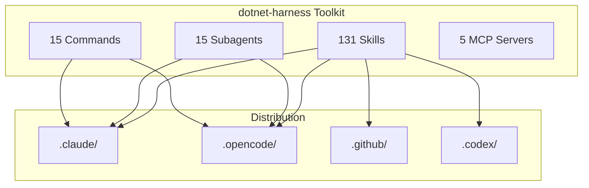

## Quick Start

```bash
# Install rulesync
npm install -g rulesync

# Fetch the toolkit
rulesync fetch rudironsoni/dotnet-harness:.rulesync

# Generate for your platform
rulesync generate --targets "*" --features "*"
```

## Platform Support

<div class="platforms">

| Platform       | Status             | Primary Agent      |
| -------------- | ------------------ | ------------------ |
| Claude Code    | ✅ Fully Supported | `dotnet-architect` |
| OpenCode       | ✅ Fully Supported | `dotnet-architect` |
| GitHub Copilot | ✅ Fully Supported | All agents         |
| Codex CLI      | ✅ Fully Supported | All agents         |
| Gemini CLI     | ✅ Fully Supported | All agents         |

</div>

## Architecture Overview



## Latest Enhancements

### Phase 4 Complete 🎉

- **5 New Commands**: `/dotnet-harness:search`, `/dotnet-harness:test`, `/dotnet-harness:profile`,
  `/dotnet-harness:graph`, `/dotnet-harness:compare`
- **VS Code Extension**: Real-time validation and autocomplete
- **Skill Manifest**: Dependency tracking and version resolution
- **Quick-Start Templates**: web-api, blazor-app, maui-mobile, clean-arch, console, classlib
- **Offline Mode**: Air-gapped environment support
- **Docker & GitHub Actions**: Containerized toolkit

[View Full Changelog](/guide/changelog)
